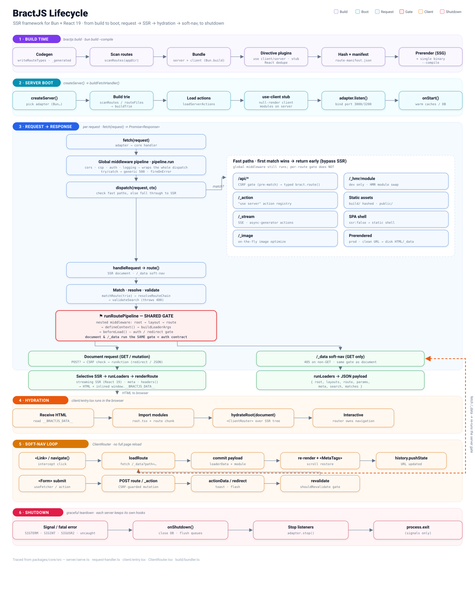

# Concepts: how BractJS works

This guide is the mental model — what actually happens between a request arriving and HTML streaming out, which of the three run modes you're in at any moment, and what does (and doesn't) ship to the browser. Nothing here is API reference; every section links to the [README](../README.md) section that is.

## The big picture



BractJS is Bun-native and server-first. A route is a file; a file may export server code (`loader`, `action`, `middleware`, `headers`), client code (the `default` component), or both — the build splits them so each side gets only what belongs to it. There is one HTTP server handling every surface: SSR documents, the soft-navigation data endpoint (`/_data`), server actions (`/_action`, `/_stream`), typed `/api` routes, image optimization (`/_image`), and static assets.

## The three run modes

The same app runs three ways, and understanding this explains most of the framework's "why is it built like that" decisions:

| Mode | Command | What runs |
| ---- | ------- | --------- |
| Dev | `bractjs dev` | Dev server with HMR; routes re-imported live on edit. |
| Production | `bractjs build` + `bractjs start` | Serves the built output. |
| Single binary | `bractjs compile` → `./myapp` | One executable; zero filesystem reads of `app/`. |

The keystone is **`app/server.ts`**. It is the compiled binary's entrypoint — but `bractjs dev` and `bractjs start` *also* import it at boot, with its module-scope `createServer()` call suppressed. That trick exists for one reason: anything registered at module scope — above all **global middleware** via `pipeline.use(...)` — applies identically in all three modes. If middleware only registered in the binary's entry, dev would silently run without your CORS/CSP/auth guards; this design makes that divergence impossible. ([§14](../README.md#14-middleware), [§22](../README.md#22-single-binary-deployment))

## The request lifecycle

Every request enters the **global pipeline** (`pipeline.use(...)` middleware — logging, CORS, CSP, auth guards). This wraps *everything*: documents, `/_data`, `/api`, `/_action`, `/_stream`, `/_image`, and static files.

For a page request, the order after that is:

```
global pipeline
  → CSRF gate (mutating methods must prove same-origin — before route matching)
  → route match (trie: static > dynamic > optional > catch-all)
  → searchSchema (validate/coerce query params; failure → 400)
  → route middleware (root → layout → route, shared mutable context)
  → beforeLoad (auth/redirect gate)
  → action (if POST/PUT/PATCH/DELETE)
  → loaders (root + every layout + route — all in parallel)
  → streaming render (renderToReadableStream; defer() fields resolve in-stream)
```

Two properties of this pipeline are worth internalizing:

**The document and `/_data` share one gate sequence.** When the user clicks a `<Link>`, the client doesn't refetch the page — it fetches `/_data`, which runs the target route's loaders and returns JSON. Critically, `/_data` runs through the *same* route middleware and `beforeLoad` gates as the full document, by construction — they literally share the code path. This closes the classic SSR-framework vulnerability where auth guards the page render but the JSON data endpoint quietly skips it. It's also why the rule is: **auth goes in `beforeLoad` or middleware, never in a component** — a component-only check would still leak loader JSON through `/_data`. ([§5](../README.md#5-route-module-api))

**Errors are sorted into intentional vs unexpected.** A thrown `redirect()` or `HttpError` is control flow: it becomes the redirect/status page and is *not* reported to `onError`. Anything else is unexpected: it's sanitized (generic message in production, full stack in dev), rendered by the nearest `ErrorBoundary` export, and reported to your `onError` lifecycle hook ([§16](../README.md#16-lifecycle-hooks)).

## Middleware: three surfaces, three scopes

This is the framework's sharpest edge — the place to slow down and read carefully:

| Surface | Covers | Register in |
| ------- | ------ | ----------- |
| Global `pipeline.use(...)` | **Everything** — documents, `/_data`, `/api`, `/_action`, `/_stream`, `/_image`, static assets | `app/server.ts` |
| Nested route `middleware` exports | The **document + `/_data`** path of that route subtree — **not** `/api`, **not** `/_action` | `root.tsx` / `layout.tsx` / route files |
| `route(..., { middleware: [...] })` | That one typed `/api` endpoint | The `route()` definition |

The consequence: a `middleware` export on `routes/admin/layout.tsx` protects every `/admin` *page* — but an `/api/admin/...` endpoint or a server action is **not** covered by it. Guard `/api` endpoints with their own `{ middleware }` option, and authorize server actions inside the function body. The [auth guide](authentication.md) walks through getting this right end to end.

## Server boot and death: lifecycle hooks

`app/lifecycle.ts` exports `defineLifecycle({ onStart, onShutdown, onError })`:

- `onStart` — once, after the server is listening (connect the DB, warm caches).
- `onShutdown` — before exit on *any* signal, programmatic stop, or uncaught exception (close the DB, flush telemetry).
- `onError` — every **unexpected** error: loader/action throws and uncaught process exceptions (where `request` is `undefined`). Redirects and `HttpError`s never appear here. Errors thrown *by the hook itself* are caught and logged, so a broken Sentry call can never mask the original error.

`bractjs dev`/`start` pick the file up automatically; a custom or compiled entry spreads it into `createServer({ ...lifecycle })`. ([§16](../README.md#16-lifecycle-hooks))

## What ships to the client

Two mechanisms keep server code out of browser bundles:

1. **Route shaking (primary).** The client build dead-code-eliminates `loader`, `action`, `headers`, and `middleware` exports from route modules — along with any imports only they used. Your DB import in a loader never reaches the client bundle.
2. **`*.server.ts` stubbing (backstop).** Modules with the `.server.ts` suffix are replaced with inert stubs on the client. Imports of them don't fail; they just do nothing. Put anything that must never leak — DB clients, secrets, token logic — in `.server.ts` files, and it's protected even if it's imported from somewhere route-shaking can't reach.

Environment variables follow the same philosophy: nothing is exposed to the client unless allowlisted via `clientEnv` ([§17](../README.md#17-environment-variables)). And loader data reaching the HTML document goes through an XSS-safe serializer.

The mirror-image mechanism is **`"use server"`**: every exported *function* of a `"use server"` module becomes a real RPC endpoint (`POST /_action`). That's a public, unauthenticated URL — treat it like one and authorize inside the function body ([§27](../README.md#27-security-model)).

## Registration: files vs imports

Two different registration models coexist — know which one you're using:

- **Pages register by existing.** A file in `app/routes/` *is* a route; the startup scan finds it. No imports needed.
- **Typed `/api` endpoints register by being imported.** A `route("GET", "/api/x", ...)` call registers as an import side-effect — the defining module must be reachable from `app/root.tsx`, or the endpoint doesn't exist (in dev *or* the compiled binary). `bractjs dev` warns at boot about defined-but-unregistered endpoints; if an `/api` route 404s, check the import chain first. ([§12](../README.md#12-typed-api-routes))

## Dev-mode change handling

Knowing what requires a restart saves real time:

- **Live, no restart** — edits to route modules, including `loader`, `action`, and `beforeLoad`: the dev server re-imports the fresh module on the next request.
- **Automatic self-restart** — `app/server.ts`, `lifecycle.ts`, any `*.server.ts`, shared non-route modules, and adding/removing route files. The browser reloads itself when its HMR socket reconnects. (Module-scope state — an in-memory store, say — resets on these.)

## Codegen, and why the binary needs it

`bun build --compile` can't trace runtime filesystem scans or dynamic imports. So the compile pipeline first *materializes* everything dynamic into static code: `codegen:registry` writes the route/action module tables, the build emits the asset manifest, `codegen:manifest` snapshots it as TypeScript. The result boots with zero reads of `app/` — the trade being that codegen output (`app/_generated/`, `route-types.gen.ts`) is generated artifact, never hand-edited. `bractjs compile` runs the whole sequence in one shot. ([§22](../README.md#22-single-binary-deployment), [deployment guide](deployment.md))
